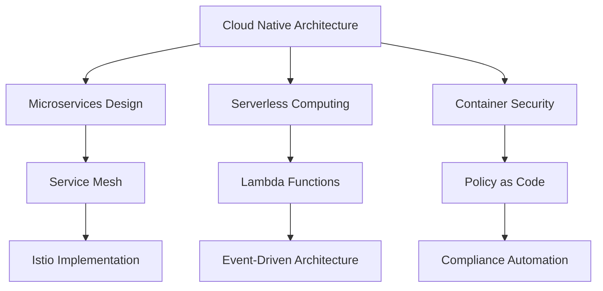

# 👋 안녕하세요! 클라우드 아키텍트입니다

  

## 🚀 About Me

<table>
<tr>
<td align="center" width="50%">

### 💼 전문 분야
🏗️ **클라우드 아키텍처 설계** 
⚙️ **Infrastructure as Code** 
🐳 **컨테이너 오케스트레이션** 
🔄 **CI/CD 파이프라인 자동화** 
💰 **클라우드 비용 최적화**

</td>
<td align="center" width="50%">

### 📊 경력 & 전문성
⏰ **2년+ 클라우드 경험** 
🎯 **AWS & Kubernetes 전문가** 
🏆 **다수의 AWS 자격증 보유** 
📈 **대규모 인프라 운영 경험** 
🌟 **클라우드 네이티브 아키텍처**

</td>
</tr>
</table>

## 🛠️ Tech Stack

### ☁️ Cloud Platforms

### 🐳 Container & Orchestration

### 🏗️ Infrastructure as Code

### 🔄 CI/CD & DevOps

### 📊 Monitoring & Observability

## 📈 GitHub Stats

  

## 🏆 AWS Certifications

| Certification | Status | Date |
|---------------|--------|------|
| 🏅 AWS Solutions Architect Professional | ✅ Certified | 2023 |
| 🏅 AWS DevOps Engineer Professional | ✅ Certified | 2023 |
| 🏅 AWS Security Specialty | ✅ Certified | 2022 |
| 🏅 AWS SysOps Administrator Associate | ✅ Certified | 2022 |

## 🎯 Current Focus

## 🌟 Featured Projects

### 🚀 Multi-Cloud Kubernetes Platform
- **Tech Stack**: EKS, GKE, AKS, Terraform, ArgoCD
- **Description**: 멀티 클라우드 환경에서 통합 Kubernetes 플랫폼 구축
- **Highlights**: 99.9% 가용성, 자동 스케일링, 비용 30% 절감

### 🔧 Infrastructure Automation Pipeline
- **Tech Stack**: Terraform, GitHub Actions, AWS CodePipeline
- **Description**: 완전 자동화된 인프라 배포 파이프라인
- **Highlights**: 배포 시간 80% 단축, 제로 다운타임 배포

### 📊 Cloud Cost Optimization Platform
- **Tech Stack**: AWS Cost Explorer API, Lambda, CloudWatch
- **Description**: 실시간 클라우드 비용 모니터링 및 최적화 시스템
- **Highlights**: 월 클라우드 비용 25% 절감

## 📚 Latest Blog Posts

<!-- BLOG-POST-LIST:START -->
- [AWS EKS에서 Istio Service Mesh 구축하기](https://kloudcomputing.tistory.com/)
- [Terraform으로 멀티 리전 인프라 자동화](https://kloudcomputing.tistory.com/)
- [Kubernetes 보안 모범 사례 가이드](https://kloudcomputing.tistory.com/)
- [서버리스 아키텍처 설계 패턴](https://kloudcomputing.tistory.com/)
<!-- BLOG-POST-LIST:END -->

## 💡 Fun Facts

- 🌱 현재 **Service Mesh**와 **GitOps** 패턴을 깊이 연구하고 있습니다
- ⚡ **Infrastructure as Code**로 하루에 수십 개의 환경을 배포할 수 있습니다
- 🎯 목표: 완전 자동화된 **Self-Healing Infrastructure** 구축
- 📖 클라우드 네이티브 기술에 대한 기술 블로그를 정기적으로 작성합니다
- 🎤 AWS 및 Kubernetes 관련 컨퍼런스에서 정기적으로 발표합니다

---

**"클라우드로 세상을 더 효율적으로 만들어가는 엔지니어"** ☁️

